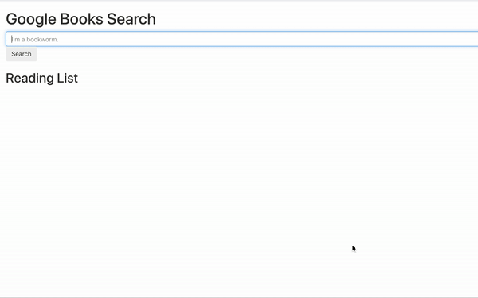

<h1 align="center">
Google Books Search
</h1>

<h4 align="center">A minimal book searching application utilzing the <a href="https://developers.google.com/books" target="_blank">Google Books API</a>.</h4>

<p align="center">
  <a href="#key-features">Main Features</a> •
  <a href="#how-to-use">How To Use</a> •
  <a href="#download">Download</a> •
  <a href="#credits">Credits</a> •
</p>



## Key Features

- LiveSearch - Search for your favorite authors, book titles, and publishing companies with the click of a button See changes
  - Instantly view the best five results from your search query.

## How To Use

To clone and run this application, you'll need [Git](https://git-scm.com) and [Node.js](https://nodejs.org/en/download/) (which comes with [npm](http://npmjs.com)) installed on your computer. From your command line:

```bash
# Clone this repository
$ git clone https://github.com/hassanmt96/bk-search.git

# Go into the repository
$ cd bk-search

# Install dependencies
$ npm install

# Run the app
$ npm start
```

Note: If you're using Linux Bash for Windows, [see this guide](https://www.howtogeek.com/261575/how-to-run-graphical-linux-desktop-applications-from-windows-10s-bash-shell/) or use `node` from the command prompt.

## Testing

This application uses Jest for testing purposes:

## Technologies

- [Node.js](https://nodejs.org/)
- [Jest](https://jestjs.io/)
- [React](https://reactjs.org/)
